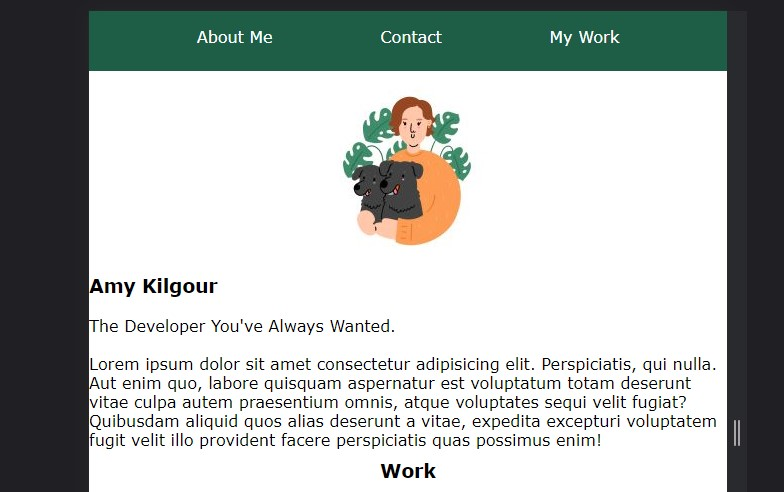

## Advanced CSS Homework Assignment

Name: Amy Kilgour

Please click [https://kilgette.github.io/professional-portfolio/](https://kilgette.github.io/professional-portfolio/) to view the live version.  

Objective: Build a portfolio page which can be used as the course progresses to highlight my work. 

What I Learned: I learned an incredible amount about styling HTML with CSS as well as
the incredible amount of efficiencies that exist. Also working with images and building pages that 
work responsively can be tough and is something I need to continue practicing to mastery.  
I look forward to utilizing the skills I'm learning to improve upon/build upon this page in 
the near future. 